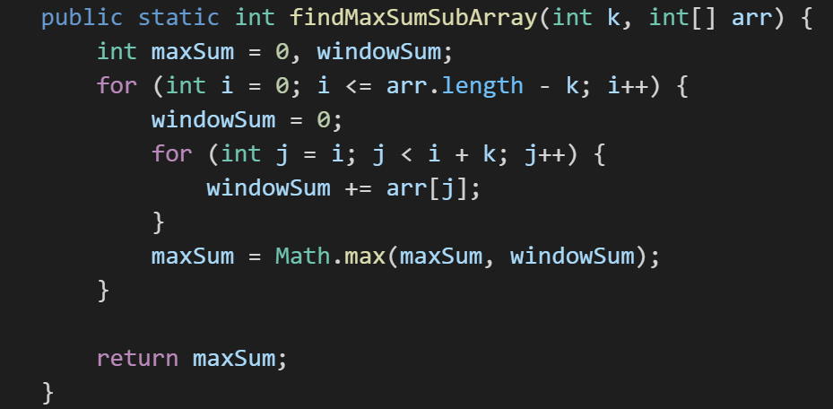
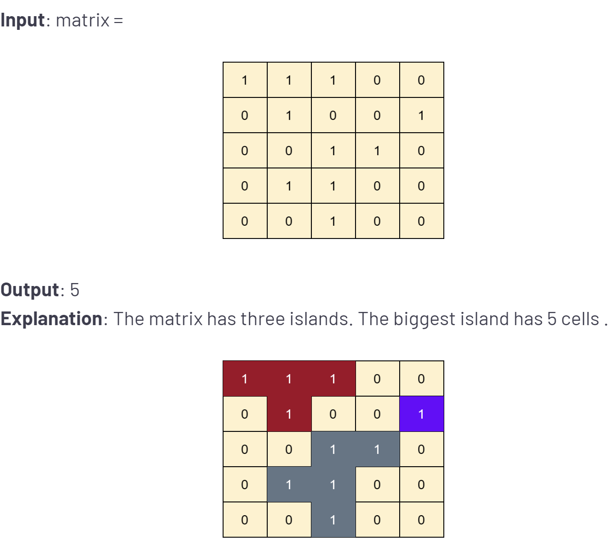
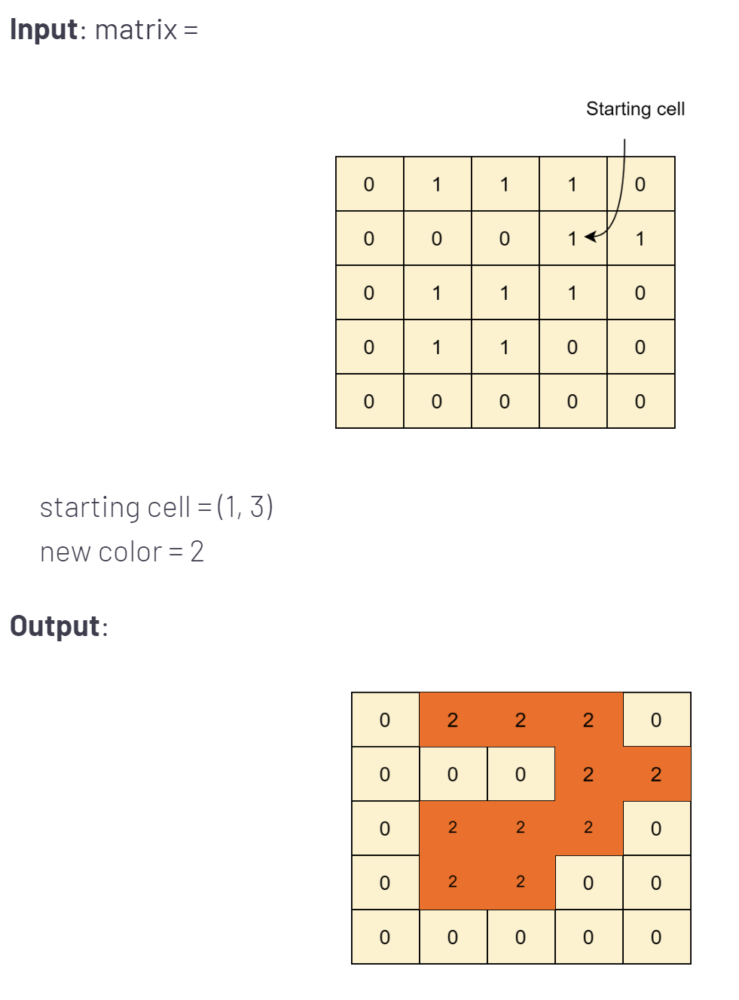
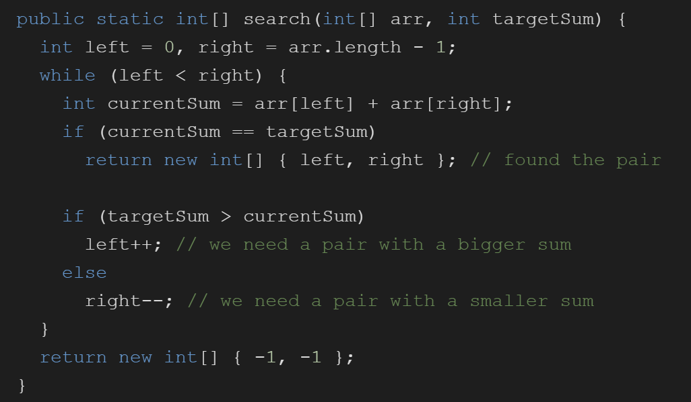
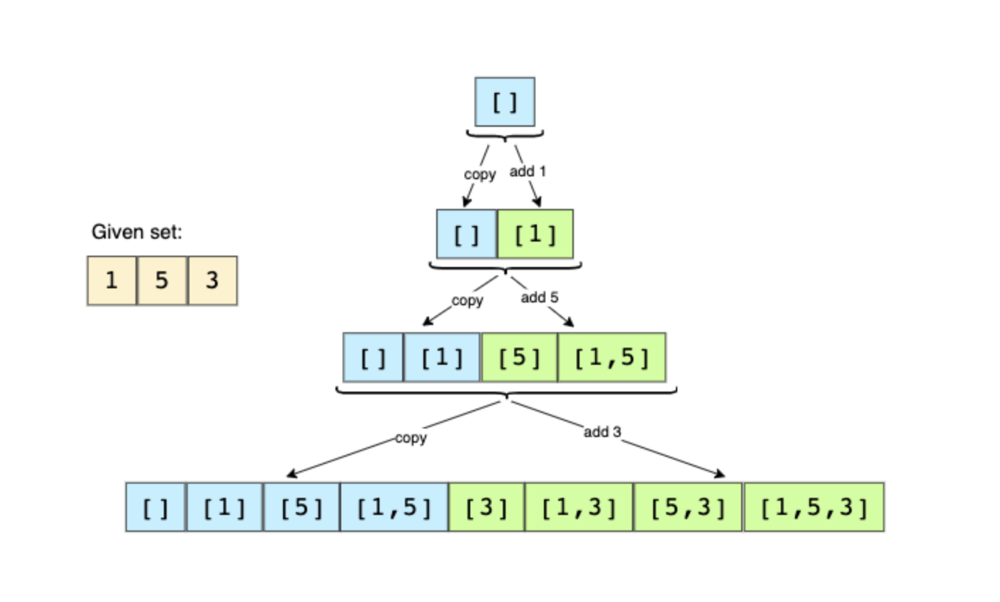
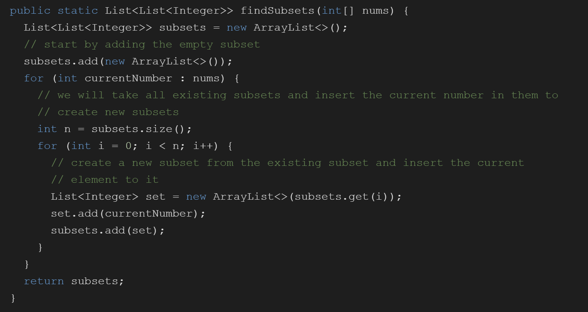

# Coding Patterns for Coding Interviews

Source:  
https://designgurus.org/course/grokking-the-coding-interview

Documentation:  
[Coding Patterns.docx](https://github.com/barrida/Grokking-Coding-Patterns/files/11850200/Coding.Patterns.docx)

# Contents
[Sliding Window](#sliding-window)  	
[Islands Matrix Traversal](#Islands-Matrix-Traversal)  
[Two Pointers](#two-pointers)  
[Top 'K' Elements](#top--k-elements)  	
[Subsets](#subsets)  
[Modified Binary Search](#modified-binary-search)  	
[BitWise XOR](#bitwise-xor)  

## Sliding Window  
In many coding problems where we are dealing with an array (or a LinkedList), we are asked to find or calculate something among all the subarrays of a given size.  
- Maximum Sum Subarray of Size K (easy)
- Smallest Subarray with a Greater Sum (easy)
- Longest Substring with K Distinct Characters (medium)

- Given an array of positive numbers and a positive number ‘k,’ find the maximum sum of any contiguous subarray of size ‘k’.





## Islands Matrix Traversal

Many coding interview problems involve traversing 2D arrays. The Island pattern describes all the efficient ways to traverse a matrix. This pattern will go through many problems to explain matrix traversal using Depth First Search and Breadth First Search approaches and their variants.
- Number of Islands (easy) 26:25  

Given a 2D array (i.e., a matrix) containing only 1s (land) and 0s (water), count the number of islands* in it.  


- Biggest Island (easy) 07:59  

Given a 2D array (i.e., a matrix) containing only 1s (land) and 0s (water), find the biggest island in it. Write a function to return the area of the biggest island.



- Flood Fill (easy) 07:39  

Any image can be represented by a 2D integer array (i.e., a matrix) where each cell represents the pixel value of the image. 

Flood fill algorithm takes a starting cell (i.e., a pixel) and a color. The given color is applied to all horizontally and vertically connected cells with the same color as that of the starting cell. Recursively, the algorithm fills cells with the new color until it encounters a cell with a different color than the starting cell.

Given a matrix, a starting cell, and a color, flood fill the matrix.




- Number of Closed Islands (easy) 10:03

*Island:  An island is a connected set of 1s (land) and is surrounded by either an edge or 0s (water). Each cell is considered connected to other cells horizontally or vertically (not diagonally).

## Two Pointers
In problems where we deal with sorted arrays (or LinkedLists) and need to find a set of elements that fulfil certain constraints, the Two Pointers approach becomes quite useful. The set of elements could be a pair, a triplet or even a subarray.

- Pair with Target Sum (easy)
- Separate Duplicates (easy)
- Squaring a Sorted Array (easy)
- Triplet Sum to Zero (medium)
- Triplet Sum Close to Target (medium)

Given an array of sorted numbers and a target sum, find a pair in the array whose sum is equal to the given target.  




## Top 'K' Elements
Any problem that asks us to find the top/smallest/frequent ‘K’ elements among a given set falls under this pattern. The best data structure that comes to mind to keep track of ‘K’ elements is Heap. This pattern will make use of the Heap to solve multiple problems dealing with ‘K’ elements at a time from a set of given elements.  

- Top 'K' Numbers (easy)
- Kth Smallest Number (easy)
- 'K' Closest Points to the Origin (easy)
- Connect Ropes (easy)
- Top 'K' Frequent Numbers (medium)

  

## Subsets

A huge number of coding interview problems involve dealing with Permutations and Combinations of a given set of elements. This pattern describes an efficient Breadth First Search (BFS) approach to handle all these problems.  

- Subsets (easy) 04:11
- Subsets With Duplicates (easy) 05:42
- Permutations (medium) 07:07
- String Permutations by changing case (medium) 04:24
- Given a set with distinct elements, find all of its distinct subsets.

Example 1:
Input: [1,3]
Output:[],[1],[3],[1,3]

Example 2:
Input:[1,5,3]
Output:[],[1],[5],[3],[1,5],[1,3],[5,3],[1,5,3]





## Modified Binary Search
As we know, whenever we are given a sorted Array or LinkedList or Matrix, and we are asked to find a certain element, the best algorithm we can use is the Binary Search. Since Binary Search helps us find a number in a sorted array efficiently, we can use a modified version of the Binary Search to find the ceiling of a number.     

- Given an array of numbers sorted in ascending order, find the element in the array that has the minimum difference with the given ‘key’.
- Given a sorted array of numbers, find if a given number ‘key’ is present in the array. Though we know that the array is sorted, we don’t know if it’s sorted in ascending or descending order. You should assume that the array can have duplicates.
- Given an array of numbers sorted in an ascending order, find the ceiling of a given number ‘key’. The ceiling of the ‘key’ will be the smallest element in the given array greater than or equal to the ‘key’.
- Given an array of lowercase letters sorted in ascending order, find the smallest letter in the given array greater than a given ‘key’.
- Given an array of numbers sorted in ascending order, find the range of a given number ‘key’. The range of the ‘key’ will be the first and last position of the ‘key’ in the array.

## BitWise XOR

XOR is a logical bitwise operator that returns 0 (false) if both bits are the same and returns 1 (true) otherwise. In other words, it only returns 1 if exactly one bit is set to 1 out of the two bits in comparison.  

- Given an array of n-1 integers in the range from 1 to n, find the one number that is missing from the array
- In a non-empty array of numbers, every number appears exactly twice except two numbers that appear only once. Find the two numbers that appear only once.

# Tips

- Create frequency map with one line of code using `getOrDefault` method.

```
Map<Character, Integer> charFrequency = new HashMap<>();

for (int i = 0; i < s.length(); i++) { 
    char current = s.charAt(i);
    charFrequency.put(current, charFrequency.getOrDefault(current, 0) + 1);
}
